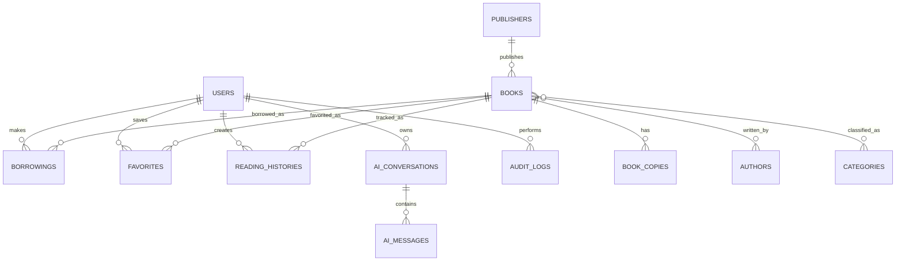

# ReadOra Phase 0: Planning and Architecture

Status: Complete
Date: 2026-08-30

This document establishes the baseline architecture for ReadOra before application code is generated.

## 1. System Architecture

ReadOra will be a Laravel monolith with clearly separated user and admin interfaces sharing one domain model and database.

- Backend: Laravel, Eloquent, Form Requests, Policies/Gates, Notifications, Jobs, Scheduler.
- Frontend: Blade, Livewire, Tailwind CSS, Alpine.js for lightweight interactivity.
- Database: MySQL or MariaDB in development and production, with portable schema choices where reasonable.
- Interfaces:
  - User area: discovery, book details, favorites, borrowing, profile, recommendations, AI chat.
  - Admin area: analytics, library management, circulation, users, audit logs, AI admin queries.
- Domain logic will live in service/action classes instead of controllers or views.
- Authorization will be enforced server-side through middleware, policies, gates, and scoped queries.

## 2. Database Architecture

Core tables:

- users: authentication, profile fields, role, preferences.
- books: ISBN, title, description, publication year, cover path, publisher, metadata.
- authors: author identity and optional biography.
- author_book: many-to-many book authorship.
- publishers: publisher identity.
- categories: hierarchical or flat category taxonomy.
- book_category: many-to-many classification.
- book_copies: physical or lendable inventory units with status.
- borrowings: checkout lifecycle, due dates, returns, overdue state.
- favorites: user-book saved items.
- reading_histories: viewed/read/borrowed interaction trail.
- recommendations: optional persisted recommendation snapshots.
- notifications: Laravel notifications table.
- audit_logs: admin and sensitive domain actions.
- ai_conversations: chat thread metadata.
- ai_messages: stored prompts/responses and safety metadata.

Indexes will be added for search, relationship joins, borrowing status, due dates, user activity, and audit filtering.

## 3. ERD



Primary relationship rules:

- A book can have multiple authors and categories.
- A book can have many copies; borrowing availability is derived from copy status.
- A borrowing belongs to one user, one book, and preferably one book copy.
- A normal user can only access their own favorites, borrowings, reading history, notifications, and AI conversations.

## 4. Roles and Permissions

Initial roles:

- user: browse books, borrow available copies, manage own profile/favorites/history, use user-scoped AI assistant.
- admin: manage books, authors, publishers, categories, copies, users, borrowing workflows, notifications, audit logs, analytics, and admin-scoped AI assistant.

Permission strategy:

- Store a simple role on users for the prototype.
- Centralize role checks through policies, gates, and route middleware.
- Prefer policy methods for model-level access.
- Admin routes will use an admin middleware and admin layout.
- User routes will not expose admin navigation or admin endpoints.

## 5. AI Architecture

AI integration will use a provider abstraction so the application can switch between NVIDIA NIM and OpenRouter.

Planned components:

- AiProviderInterface: shared contract for chat completion calls.
- NvidiaNimProvider: NVIDIA NIM implementation.
- OpenRouterProvider: OpenRouter implementation.
- AiManager: resolves provider from config.
- AiAssistantService: orchestrates context, authorization, prompt construction, and response handling.
- AiContextBuilder: builds role-aware, permission-filtered context.
- AiSafetyService: checks disallowed requests and prompt-injection patterns.
- AiConversationService: persists conversations and messages.

Configuration will live in `config/ai.php` and `.env.example`.

## 6. AI Security

AI must never be the authorization boundary. Laravel policies and scoped queries decide what data can be retrieved before any context reaches the model.

Controls:

- Do not send secrets, environment values, API keys, password hashes, tokens, or full database dumps.
- Build context from allowlisted query methods.
- Scope normal user context to the authenticated user's own data.
- Scope admin context to approved aggregate or management data.
- Reject or deflect prompt-injection attempts that request policy bypass, secrets, hidden prompts, or another user's data.
- Log AI safety decisions without storing secrets.
- Rate limit AI endpoints.

## 7. Recommendation Architecture

Recommendations will start with transparent application logic rather than an LLM dependency.

Signals:

- User favorites.
- Borrowing history.
- Reading history.
- Category similarity.
- Author similarity.
- Popularity and recency.
- Availability.

`RecommendationService` will calculate scores from weighted signals and return explainable recommendations. The design can later support cached recommendation snapshots or vector/RAG features.

## 8. UI and Page Architecture

Visual direction:

- Academic, premium, calm library identity.
- Deep navy/midnight base, warm gold/amber accents, neutral surfaces.
- Light, dark, and system theme modes with persisted preference.

User pages:

- Home/discovery.
- Book listing with search and filters.
- Book details.
- User dashboard.
- Favorites.
- Borrowing history.
- Profile/settings.
- AI assistant.

Admin pages:

- Admin dashboard.
- Books CRUD.
- Authors CRUD.
- Publishers CRUD.
- Categories CRUD.
- Book copies/inventory.
- Borrowings/circulation.
- Users.
- Notifications.
- Audit logs.
- AI assistant/admin insights.

Reusable UI:

- App layouts for guest, user, and admin.
- Navigation components.
- Book cards and availability badges.
- Filter/search controls.
- Tables with empty/loading states.
- Theme toggle.
- Form components.
- Alert/notification components.

## 9. Project Folder Structure

Target Laravel structure:

```text
app/
  AI/
    Contracts/
    Providers/
    Services/
  Actions/
  Http/
    Controllers/
    Livewire/
    Middleware/
    Requests/
  Models/
  Notifications/
  Policies/
  Services/
database/
  data/
  factories/
  importers/
  migrations/
  seeders/
docs/
  ai/
  architecture/
  configuration/
  deployment/
  progress/
  testing/
resources/
  css/
  js/
  views/
    admin/
    auth/
    components/
    layouts/
    user/
routes/
  web.php
  admin.php
tests/
  Feature/
  Unit/
```

## 10. Data Strategy for 100-300 Real Books

Use a curated CSV/JSON import file with approximately 150 real public-domain or widely known books. Prefer sources such as Open Library metadata, Project Gutenberg metadata, or manually curated bibliographic records.

Dataset fields:

- title
- subtitle
- ISBN when available
- authors
- publisher
- publication year
- description
- categories
- cover URL or local cover path
- page count when available
- language

Import pipeline:

- Store raw curated data in `database/data/books.json`.
- Validate and normalize through an importer class.
- Seed authors, publishers, categories, books, and copies idempotently.
- Avoid fake books as the main dataset.
- Keep volume moderate for development and grading.

## 11. Testing Strategy

Test layers:

- Unit tests for services: recommendations, AI safety, context builders.
- Feature tests for auth, roles, route access, CRUD, borrowing lifecycle.
- Authorization tests for user/admin boundaries.
- Database tests for relationships, constraints, and availability logic.
- AI security tests for secret requests, cross-user data requests, and prompt injection.
- Basic UI smoke tests for important pages.

Phase 1 smoke tests:

- App boots.
- Database connection works.
- Base layouts render.
- Theme preference can be set.

## 12. Deployment Strategy

Production target:

- PHP 8.3+ or 8.4.
- Composer install with optimized autoload.
- Node build pipeline for assets.
- MySQL/MariaDB.
- Queue worker for notifications and expensive tasks.
- Scheduler configured for due-date reminders and overdue checks.

Deployment documentation will cover:

- Environment variables.
- File storage.
- Queue and scheduler setup.
- Database migrations and seed strategy.
- Backups.
- Logging and monitoring.
- Security headers and rate limits.

## 13. Documentation Structure

Planned documentation:

- `README.md`: overview, setup, development commands.
- `docs/architecture/phase-0-plan.md`: architecture baseline.
- `docs/architecture/decision-log.md`: major architecture decisions.
- `docs/ai/providers.md`: provider abstraction details.
- `docs/configuration/ai-configuration.md`: environment configuration.
- `docs/progress/current-phase.md`: phase status.
- `docs/progress/changelog.md`: chronological changes.
- `docs/testing/`: testing strategy and QA.
- `docs/deployment/`: deployment and production checklist.

## 14. Development Roadmap

1. Phase 1: Laravel foundation, environment, Tailwind, base layouts, theme system, docs.
2. Phase 2: Authentication and authorization.
3. Phase 3: Database and library data.
4. Phase 4: User interface.
5. Phase 5: Borrowing system.
6. Phase 6: Recommendation engine.
7. Phase 7: Admin dashboard.
8. Phase 8: AI assistant foundation.
9. Phase 9: AI authorization and RAG-ready context.
10. Phase 10: Notifications and background jobs.
11. Phase 11: Testing and security.
12. Phase 12: Production hardening.
13. Phase 13: Deployment preparation.
14. Phase 14: Final QA.

## 15. Risks and Mitigations

| Risk | Mitigation |
| --- | --- |
| Scope grows too large for a graduation prototype | Build by phases, stop after each phase, prioritize core workflows. |
| AI leaks sensitive data | Server-side authorization, allowlisted context builders, no secrets in prompts, security tests. |
| Admin/user boundaries blur | Separate route files, layouts, middleware, policies, and navigation. |
| Dataset quality is weak | Use real curated records and an import validator. |
| Borrowing state becomes inconsistent | Use database transactions, constraints, and service classes. |
| UI becomes generic | Establish brand tokens and domain-specific components in Phase 1. |
| Testing gets postponed | Add targeted tests during each feature phase. |
| Provider-specific AI code leaks into app | Keep provider implementations behind an interface and manager. |
