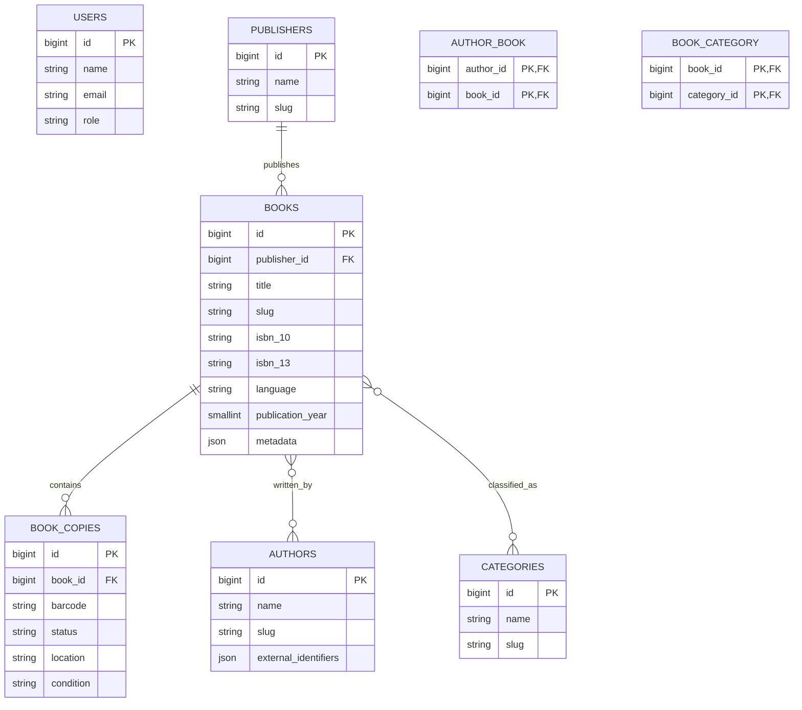

# Entity Relationship Diagram

```mermaid
erDiagram
    USERS {
        bigint id PK
        string name
        string email
        string role
    }

    PUBLISHERS {
        bigint id PK
        string name
        string slug
    }

    AUTHORS {
        bigint id PK
        string name
        string slug
        json external_identifiers
    }

    CATEGORIES {
        bigint id PK
        string name
        string slug
    }

    BOOKS {
        bigint id PK
        bigint publisher_id FK
        string title
        string slug
        string isbn_10
        string isbn_13
        string language
        smallint publication_year
        json metadata
    }

    BOOK_COPIES {
        bigint id PK
        bigint book_id FK
        string barcode
        string status
        string location
        string condition
    }

    AUTHOR_BOOK {
        bigint author_id PK,FK
        bigint book_id PK,FK
    }

    BOOK_CATEGORY {
        bigint book_id PK,FK
        bigint category_id PK,FK
    }

    PUBLISHERS ||--o{ BOOKS : publishes
    BOOKS ||--o{ BOOK_COPIES : contains
    BOOKS }o--o{ AUTHORS : written_by
    BOOKS }o--o{ CATEGORIES : classified_as
```
