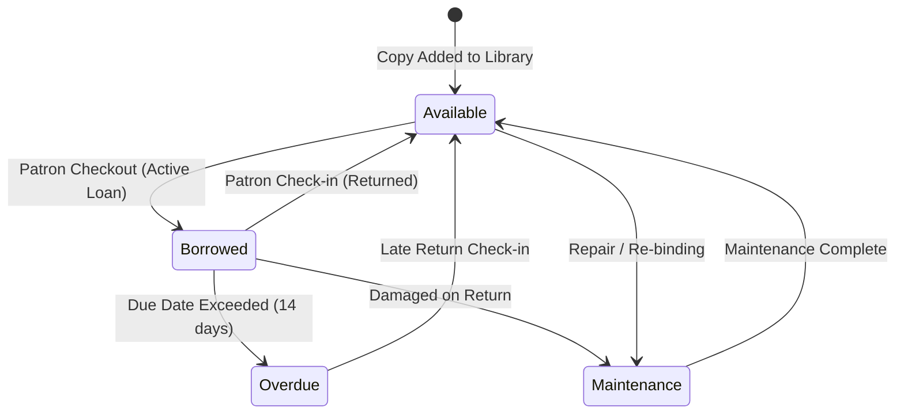

# Borrowing & Circulation System

The ReadOra Borrowing & Circulation System manages physical book checkouts, returns, renewals, due date calculations, concurrency safety, patron loan limits, and saved favorites.

---

## 1. Circulation Lifecycle & State Machine

---

## 2. Business Rules & Constraints

1. **Patron Active Loan Cap**:
   - Each patron may hold at most **5 active loans** concurrently (`BorrowingService::MAX_ACTIVE_LOANS = 5`).
2. **Duplicate Loan Prevention**:
   - A patron cannot check out multiple copies of the exact same bibliographic title at the same time.
3. **Concurrency & Race Condition Protection**:
   - Copies are selected and locked using database row locking (`lockForUpdate()`) inside an atomic `DB::transaction()`.
4. **Loan Duration & Renewals**:
   - Default loan period is **14 calendar days**.
   - Active loans that are not overdue can be renewed online by patrons, extending the due date by 14 days.
5. **Reading History Tracking**:
   - The system records patron reading milestones (`borrowed`, `returned`, `favorited`) in the `reading_histories` table for content-based recommendation scoring.

---

## 3. Database Schema

### `borrowings` Table
- `id`: Primary key.
- `user_id`: Foreign key referencing `users.id` (cascades on delete).
- `book_copy_id`: Foreign key referencing `book_copies.id` (cascades on delete).
- `borrowed_at`: Timestamp when copy was checked out.
- `due_at`: Timestamp when copy is due back.
- `returned_at`: Nullable timestamp when copy was returned.
- `status`: String/Enum (`active`, `returned`, `overdue`, `lost`).
- `notes`: Optional string/text for librarian notes.
- Indexes: `(user_id, status)`, `(book_copy_id, status)`, `(status, due_at)`.

### `favorites` Table
- `id`: Primary key.
- `user_id`: Foreign key referencing `users.id`.
- `book_id`: Foreign key referencing `books.id`.
- Unique constraint: `(user_id, book_id)`.

### `reading_histories` Table
- `id`: Primary key.
- `user_id`: Foreign key referencing `users.id`.
- `book_id`: Foreign key referencing `books.id`.
- `action`: String (`borrowed`, `returned`, `favorited`, `viewed`).
- Indexes: `(user_id, action)`, `(book_id, action)`.

---

## 4. Key Endpoints

| Method | URI | Action | Auth Requirement |
|---|---|---|---|
| `GET` | `/borrowings` | List active loans and past borrowing history | Authenticated Patron |
| `POST` | `/borrowings` | Check out an available copy of a book (`book_id`) | Authenticated Patron |
| `POST` | `/borrowings/{borrowing}/return` | Check in and return a borrowed copy | Loan Owner or Admin |
| `POST` | `/borrowings/{borrowing}/renew` | Extend loan due date by 14 days | Loan Owner or Admin |
| `GET` | `/favorites` | View patron saved favorites | Authenticated Patron |
| `POST` | `/favorites/toggle/{book}` | Add or remove book from favorites | Authenticated Patron |
