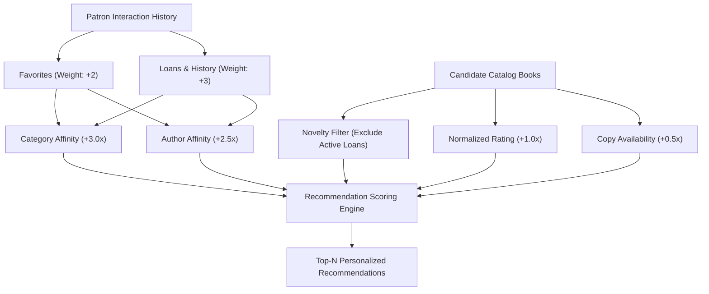

# Content-Based Recommendation Engine

ReadOra includes an intelligent, rule-based recommendation engine (`App\Services\RecommendationService`) designed to deliver personalized book discoveries to patrons based on multi-signal reading interactions without requiring heavy external ML dependencies.

---

## 1. Multi-Signal Scoring Architecture

---

## 2. Recommendation Signals & Scoring Formula

For each candidate book $B$ in the library catalog:

$$\text{Score}(B) = \sum_{c \in \text{Categories}(B)} W_{\text{cat}}(c) \cdot 3.0 + \sum_{a \in \text{Authors}(B)} W_{\text{auth}}(a) \cdot 2.5 + \text{Rating}(B) \cdot 1.0 + \text{AvailabilityBoost}(B) \cdot 0.5$$

1. **Category Affinity ($W_{\text{cat}}$)**:
   - Each category associated with a favorited book adds $+2.0$.
   - Each category associated with a borrowed book adds $+3.0$.
2. **Author Affinity ($W_{\text{auth}}$)**:
   - Each author associated with a favorited book adds $+2.0$.
   - Each author associated with a borrowed book adds $+3.0$.
3. **Rating & Quality Score**:
   - Directly incorporates the book's `average_rating` (out of 5.0).
4. **Availability Bonus**:
   - $+0.5$ bonus if at least one physical copy is currently available in the stacks.
5. **Novelty Filtering**:
   - Books currently actively checked out by the patron are excluded from recommendations.
   - Favorited books are retained with a slight score discount ($0.7\times$) so new unread titles rank higher.

---

## 3. Cold Start & Guest Handling

For unauthenticated guests or new patrons with no borrowing/favorite history:
- The system automatically serves top-rated, highly-reviewed books with currently available physical copies (`getDefaultRecommendations`).

---

## 4. Similar Books Matching

The `getSimilarBooks(Book $book, int $limit = 4)` method powers the "Related Books" section on the Book Details page (`/books/{slug}`):
- Matches books with overlapping categories and authors.
- Excludes the current book itself.
- Sorts by category overlap count and average rating.
